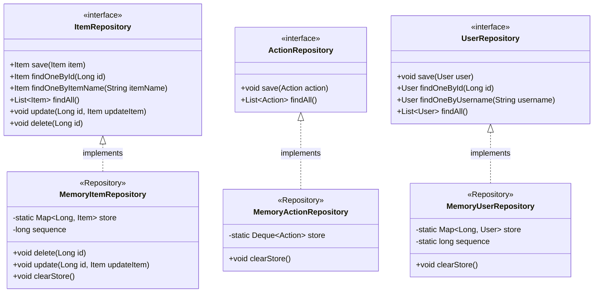

## 사용 기술

- Spring MVC
- Thymeleaf
- TailwindCSS
- HTML5
- CSS3

## 소개

이 프로젝트는 `Spring MVC`와 `Thymeleaf`등을 학습하며 각종 기능에 대해 알아보기 위한 프로젝트로 시작해서 단순한 구조를 가지고 있습니다.

제 구름 IDE의 크레딧이 남아 있는 동안엔 다음의 링크에서 프로젝트를 확인해보실 수 있습니다. [프로젝트 살펴보기](https://spring-lab.run.goorm.io) 

## 배포를 구름 IDE로 하게 된 이유
AWS 계정 무료 플랜을 이미 사용해서 다른 방법을 찾다가 구름 IDE 컨테이너를 통해서 배포하는 방법을 알게 됐습니다. 무료 크레딧을 제공해주기도 하고, 배포하기 편리해서 사용합니다.

### 웹 계층과 도메인 계층 분리

웹 계층과 도메인 계층을 분리하여 개발 하였습니다. 단순히 웹 계층은 도메인을 의존하지만 도메인은 웹 계층에 의존적이지 않습니다.
따라서 웹 계층을 얼마든지 수정해도 도메인 계층에 사이드 이펙트가 발생하지 않습니다.

### 회원가입과 로그인

회원가입 시에 패스워드를 암호화 하지 않습니다. 추후 다른 프로젝트를 할 땐 `스프링 시큐리티`를 학습해서 진행해보려고 합니다.

### 세션 방식 인증/인가

유저가 로그인에 성공하면 `Servlet`이 지원하는 세션 관리 기능을 통해 손쉽게 세션 인증 방식을 이용합니다. 세션 인증 방식은 다음과 같이 작동합니다.

- 세션 저장소
- 쿠키

기본적으로 쿠키는 웹 브라우저인 클라이언트 사이드에 저장됩니다. 따라서 클라이언트의 중요한 정보를 담기에는 쿠키 탈취 등 보안에 취약한 부분이 있습니다.
그래서 세션 방식 인증은 세션 저장소를 서버 사이드에서 사용합니다.

세션 저장소는 예측할 수 없는 문자열(예: UUID)을 키로 사용하고 값을 유저로 사용합니다.

- 로그인에 성공하면 쿠키의 값으로 UUID를 사용합니다. 클라이언트에게 쿠키를 발급 합니다.
- 쿠키를 발급함과 동시에 서버의 세션 저장소에 해당 UUID를 키로, 로그인 한 유저를 값으로 하는 Map 자료구조에 저장합니다.
- 클라이언트는 해당 쿠키를 매 요청마다 포함하여 서버에 전송합니다.
- 서버는 해당 쿠키의 값인 UUID를 조회하여 세션 저장소에 해당 UUID의 데이터가 존재하는지 확인하고 인증/인가 로직을 처리합니다.

현재 프로젝트에서 인증은 `AuthController`를 사용하고 인가 로직은 `LoginCheckInterceptor`를 통해 작동합니다.

### 스프링 메시지, 국제화

프로젝트는 일부분에 메시지 기능을 활용해서 뷰 템플릿을 렌더링 하거나, 에러 메세지를 출력합니다.
그런데 일부분은 메시징 기능을 활용하지 못했습니다. (귀찮아서 그랬습니다.)

### HTTP 요청 입력 검증 및 예외 처리

빈 검증기(Bean Validation)를 통해서 입력 커맨드 객체를 검증하고, 타임리프와 통합하여 오류 메시지를 출력합니다.
만약 도메인 계층에서 예외가 발생하면 웹 계층의 컨트롤러에서 적절히 처리합니다.

여기서 메시지 기능이 활용되어서 `errors.properties`에 작성한 에러 메시지가 사용됩니다.

### 역할 기반 접근 제어(RBAC)

`RBAC`는 말 그대로 역할(USER, MANAGER, ADMIN)에 따라 기능에 대한 접근을 제어하는 것을 의미합니다.

- `GradeInterceptor`를 통해서 이 기능을 구현하고 있습니다.
- `Thymeleaf` 템플릿에서는 세션 여부를 조회하고 특정 태그들을 조건부로 렌더링 하고 있습니다.

### CSS 프레임워크 (Tailwind)

테일윈드를 사용해서 웹 전반에 손 쉽게 공통 디자인을 적용했습니다. 디자인은 문외한이라 단순하고 실용적으로 만들었습니다.

이렇듯 단순한 웹 서비스 같은 경우(예: 어드민 페이지)는 혼자 구현 가능 합니다.

### 다형성

다형성은 객체 지향 프로그래밍의 꽃입니다. 다형성과 스프링 컨테이너의 의존 관계 주입을 활용합니다.
따라서 다음의 인터페이스를 구현하면 쉽게 교체할 수 있습니다.

아쉬운 점은 위의 클래스 다이어그램을 살펴보면 `MemoryRepository`들은 모두 공통적으로 `store` 속성, 그리고 `clearStore` 메서드를 가져야 합니다.
따로 추상 클래스로 빼보려 했지만 각 구현체마다 `store`의 타입이 다르기 때문에 실패 했습니다.

문제는 `Map`은 `Collection` 타입이 아니고, `Deque`는 `Collection` 타입 입니다. 그렇다고 최상위 객체인 `Object`를 사용하자니 타입 안정성이 문제가 됩니다. 부족한 실력 탓에
그냥 두었습니다.
